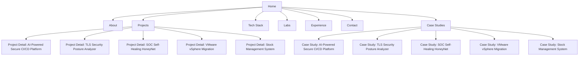
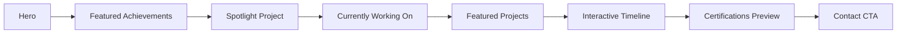

# Portfolio Architecture Document

## 1. Overall Product Vision

### Mission
The portfolio exists to position the author as a cybersecurity engineering candidate with a strong specialization in AI security, DevSecOps, cloud security, and offensive security. It should act as a high-trust professional signal for recruiters and hiring managers in Europe and global tech companies.

### Target Audience
- Final-year engineering students seeking internships and early-career roles
- Recruiters in cybersecurity, cloud, and platform engineering teams
- Hiring managers at companies such as Thales, Airbus Defence & Space, Orange Cyberdefense, Capgemini, Sopra Steria, Eviden, Microsoft, and Amazon
- Technical leads evaluating practical depth, clarity, and maturity

### Recruiter Journey
1. Recruiter lands on the homepage and understands the specialization within seconds.
2. They quickly scan the profile summary, key skills, and featured projects.
3. They explore one or two projects that demonstrate depth and technical relevance.
4. They review experience and certifications to confirm credibility.
5. They contact the candidate through a clear and frictionless contact path.

### Objectives
- Communicate a premium engineering identity immediately
- Demonstrate technical depth beyond a generic student profile
- Build trust through clarity, consistency, and precision
- Present projects as evidence of applied security engineering thinking
- Increase conversion from recruiter views to contact and interview opportunities

---

## 2. Information Architecture

### Navigation
The navigation must be lightweight, intent-driven, and easy to scan.

Primary navigation:
- Home
- About
- Projects
- Tech Stack
- Labs
- Experience
- Contact

Optional secondary links:
- Case Studies
- Certifications
- Resume / CV
- LinkedIn / GitHub / Email

### Home Sections
- Hero with brand statement and visible specialization
- Featured achievement strip
- AI-Powered Secure CI/CD Platform spotlight
- Currently Working On
- Featured projects
- Interactive experience timeline
- Certifications and credentials preview
- Contact CTA

### Page Hierarchy
- Home
  - Hero
  - Featured Achievements
  - Spotlight Project
  - Currently Working On
  - Featured Projects
  - Interactive Timeline
  - Certifications preview
  - Contact CTA
- About
  - Profile story
  - Values and positioning
  - Security domains
- Projects
  - Project index
  - Filters by domain or stack
  - Detailed project pages
- Tech Stack
  - Skill categories
  - Technology inventory
  - Capability map
- Labs
  - Labs overview
  - Active Directory
  - Red Team
  - Cloud Security
  - Web Exploitation
  - CTFs
  - Writeups
  - Research
- Experience
  - Interactive timeline with role detail cards
- Contact
  - Contact form or mailto CTA
  - Social links
  - Availability statement
- Case Studies
  - AI-Powered Secure CI/CD Platform
  - TLS Security Posture Analyzer
  - SOC Self-Healing HoneyNet
  - VMware vSphere Migration
  - Stock Management System

### Case Studies
A dedicated case study section is essential for converting technical recruiters into convinced stakeholders. Each major project must have its own detailed case study that proves depth, architecture discipline, and security thinking.

Each case study entry should include:
- Overview
- Problem
- Objectives
- Architecture
- Security Considerations
- Technologies
- Challenges
- Results
- Lessons Learned
- Screenshots
- Demo
- GitHub Repository

Why case studies matter for recruiters:
- They reveal the candidate's problem-solving process, not just outcomes.
- They provide evidence of architectural judgment and security tradeoffs.
- They make technical impact easier to evaluate quickly.
- They allow recruiters to validate narrative against concrete deliverables.
- They separate this portfolio from templated showcases.

### Site Map


### Internal Links
- Hero CTA links to contact or featured project
- Spotlight project card links to detailed project and case study
- Timeline entries link to project work and achievement pages
- Tech Stack entries link to project relevance and labs capabilities
- Labs items link to research and writeups
- Footer links support resume, GitHub, and social profiles

### User Flow
1. Visitor lands on Home
2. Visitor reads brand statement and sees core security domains
3. Visitor explores the spotlight project and key achievements
4. Visitor discovers current interests and technical maturity through timeline
5. Visitor drills into projects, tech stack, labs, or case studies
6. Visitor reaches Contact with a strong conversion path

---

## 3. Folder Architecture

The project should remain simple, scalable, and aligned with App Router conventions.

```text
bagy-portfolio/
  app/
    (marketing)/
      page.tsx
      about/page.tsx
      projects/page.tsx
      projects/[slug]/page.tsx
      tech-stack/page.tsx
      labs/page.tsx
      experience/page.tsx
      contact/page.tsx
      case-studies/page.tsx
      case-studies/[slug]/page.tsx
    layout.tsx
    globals.css
    not-found.tsx
  components/
    layout/
      navbar.tsx
      footer.tsx
      skip-link.tsx
      page-shell.tsx
    sections/
      hero.tsx
      spotlight-project.tsx
      achievements.tsx
      current-work.tsx
      featured-projects.tsx
      interactive-timeline.tsx
      certifications.tsx
      tech-stack.tsx
      labs.tsx
      case-study-list.tsx
    ui/
      button.tsx
      badge.tsx
      card.tsx
      icon-pill.tsx
      heading.tsx
      grid.tsx
      section-container.tsx
      separator.tsx
    project/
      project-card.tsx
      project-detail-hero.tsx
      project-overview.tsx
      architecture-panel.tsx
    experience/
      timeline-item.tsx
      experience-card.tsx
    contact/
      contact-form.tsx
      contact-card.tsx
  data/
    projects.ts
    case-studies.ts
    experience.ts
    skills.ts
    certifications.ts
    socials.ts
    navigation.ts
    labs.ts
    achievements.ts
    interests.ts
  hooks/
    use-scroll-reveal.ts
    use-prefers-reduced-motion.ts
    use-interactive-timeline.ts
  lib/
    metadata.ts
    seo.ts
    utils.ts
    analytics.ts
  public/
    images/
    icons/
    og/
    video/
  styles/
    tokens.css
    motion.css
  types/
    content.ts
    project.ts
    experience.ts
    skill.ts
    lab.ts
    case-study.ts
  utils/
    format.ts
    cn.ts
  content/
    blog/
    writeups/
  docs/
    ARCHITECTURE.md
  package.json
  tsconfig.json
  next.config.ts
  tailwind.config.ts
```

### Folder Explanations
- app/: App Router entry points, layouts, route pages, and global application shell
- components/layout/: Repeatable shell elements such as navbar, footer, skip link, and page container
- components/sections/: High-level sections built from UI primitives and page composition patterns
- components/ui/: Design primitives and shadcn/ui wrappers that guarantee consistency
- components/project/: Project-specific views and architecture storytelling panels
- components/experience/: Interactive timeline, role cards, and experience-related UI
- components/contact/: Contact form, cards, and CTA components
- data/: Typed data modules for projects, case studies, skills, labs, achievements, interests, navigation, and metadata
- hooks/: Reusable interaction hooks for motion, accessibility, and timeline state
- lib/: SEO, metadata, analytics, and helper abstractions separated from UI
- public/: Static assets, images, icons, social previews, and demo video placeholders
- styles/: Design tokens, motion presets, and global styling conventions
- types/: Domain-specific TypeScript interfaces for content shape and page contracts
- utils/: Formatting, class name merging, and shared utility functions
- content/blog/: Future editorial content and security writeups
- content/writeups/: Lab research outputs and CTF summaries
- docs/: Architecture and project documentation

---

## 4. App Router Architecture

### Route Map
| Route | Purpose | Why it exists |
|---|---|---|
| / | Primary landing experience, brand positioning, and featured case study spotlight | First impression focused on AI Security, Cloud Security, DevSecOps, and Offensive Security |
| /about | Explains the candidate's story, values, and security domain focus | Reinforces credibility and personal brand |
| /projects | Portfolio index for all major technical work and project summaries | Collects evidence of capabilities |
| /projects/[slug] | In-depth project page with architecture, results, and technologies | Supports recruiter deep-dive into implementation |
| /tech-stack | Dedicated skills and technology page organized by category | Communicates capability map and specialization clearly |
| /labs | Operational security lab playground and research showcase | Demonstrates practical learning, active experimentation, and tactics |
| /experience | Interactive timeline of professional roles and achievements | Presents roles as a career story instead of a static list |
| /contact | Conversion destination for recruiters and collaborators | Provides immediate contact options and availability |
| /case-studies | Case study hub with major project narratives | Proves architectural discipline and security impact |
| /case-studies/[slug] | Detailed case study page for a single project | Supports deep recruiter review of major work |
| /not-found | Graceful fallback for missing routes | Preserves polish and trust |

### Routing Principles
- Use shallow static routes for primary navigation.
- Use dynamic routes only for content-rich entities like projects and case studies.
- Keep content pages composable and data-driven.
- Ensure each route can be statically rendered for maximum Vercel performance.
- Use dedicated pages when content is high-value and not simply a section of a larger page.

### Home Page Update
Home must immediately communicate the personal brand using the hero headline:
"Building Secure Infrastructure with AI, DevSecOps & Offensive Security."

Home structure:
- Hero with identity statement and core security domains
- Featured Achievements strip
- Spotlight on AI-Powered Secure CI/CD Platform
  - Large hero card with architecture preview
  - GitHub button
  - Live demo button
  - Video demo placeholder
  - Key metrics
  - Tech stack badges
- Currently Working On section
- Featured projects grid
- Interactive experience timeline
- Certifications preview
- Contact CTA



### Tech Stack Page
The Tech Stack page must be a full page, not just a list. It should organize skills into the following categories:
- Programming
- Cloud
- DevSecOps
- Offensive Security
- Networking
- Operating Systems
- AI
- Databases
- Monitoring
- Virtualization

### Tech Stack Category Table
| Category | Focus | Example Technologies |
|---|---|---|
| Programming | Secure infrastructure and scripting | TypeScript, Python, Go, Java |
| Cloud | Cloud-native security and automation | AWS, Azure, Terraform, CloudFormation |
| DevSecOps | CI/CD security and pipeline reliability | Jenkins, Docker, Kubernetes, GitHub Actions |
| Offensive Security | Attack simulation and threat discovery | TryHackMe, Metasploit, Burp Suite, Cobalt Strike |
| Networking | Secure connectivity and posture | TLS, VPN, BGP, Firewalls |
| Operating Systems | Host hardening and incident response | Linux, Windows Server, Ubuntu, CentOS |
| AI | ML-driven security tooling and analysis | FastAPI, Groq LLM, Python ML stacks |
| Databases | Data persistence and secure access | PostgreSQL, MySQL, Redis |
| Monitoring | Observability and incident detection | Prometheus, Grafana, ELK |
| Virtualization | Infrastructure and migration | VMware vSphere, Docker, Kubernetes |

Each category should have a concise introduction, a capability summary, and a badge grid.

### Labs Page
The Labs page should expose practical security learnings and active research as an experience asset.

Labs structure:
- Labs overview
- Active Directory
- Red Team
- Cloud Security
- Web Exploitation
- CTFs
- Writeups
- Research

The Labs page is a tangible signal of active technical curiosity and practice.

### Interactive Experience Timeline
The Experience page should replace a static list with an interactive vertical timeline.

Timeline order:
- ABSEC
- HackSecure
- Optipark

Each timeline item includes:
- Role
- Duration
- Technologies
- Achievements

The same component should be reused on the Home page for the compact Timeline section.

---

## 5. Component Architecture

### Reusable Components
| Component | Responsibility |
|---|---|
| Navbar | Provides top-level navigation, route awareness, and mobile toggle |
| Footer | Houses contact links, social links, résumé CTA, and micro-copy |
| Skip Link | Enables keyboard users to jump directly to main content |
| Hero | Introduces the candidate, brand headline, and core security pillars |
| SectionHeading | Standardizes section titles, supporting copy, and spacing |
| SpotlightProject | Large featured project section with buttons, metrics, and preview panels |
| ProjectCard | Summarizes a featured project in a concise, premium visual block |
| ProjectDetailHero | Renders project title, position, problem statement, and role |
| TechStackGrid | Organizes skills by category, with tier and familiarity labels |
| LabCard | Presents lab domains, tools, and research outcomes |
| CaseStudyCard | Summarizes each major case study and links to full narrative |
| Timeline | Displays interactive vertical timeline entries |
| TimelineItem | Presents role details, technologies, and achievements |
| ExperienceCard | Presents an individual role in a detail panel |
| AchievementStrip | Highlights featured accomplishments on Home page |
| CertificationCard | Shows certifications with issuing body and date |
| Badge | Highlights skill domains, tools, or capability tags |
| Button | Implements primary, secondary, and tertiary actions consistently |
| IconBadge | Presents tools or technologies with a minimal visual treatment |
| ThemeToggle | Handles dark/light mode if needed in future iterations |
| SectionContainer | Standardizes responsive content width and vertical rhythm |
| GridSystem | Provides spacing and layout consistency across pages |
| VideoPanel | Embeds video demo or media preview within project spotlight |
| ArchitecturePanel | Visualizes architecture, security layers, and tech stack |
| StatsCard | Displays key metrics and impact data for a project |

### Component Composition Strategy
- Layout components define page structure and spacing.
- Section components group related content for reuse across pages.
- UI primitives ensure visual and interaction consistency.
- Data-driven content components read from typed modules.
- A single timeline component should serve both Home and Experience pages.
- The spotlight project component should remain reusable for any featured work.

---

## 6. Data Architecture

The portfolio should be content-driven rather than hardcoded across pages. All content should originate from typed data modules in the data layer.

### Data Modules
| File | Purpose | Core Entities |
|---|---|---|
| data/projects.ts | Central project content | Project, stack, summary, links |
| data/case-studies.ts | Detailed narratives for major work | CaseStudy |
| data/experience.ts | Interactive timeline content | ExperienceEntry |
| data/skills.ts | Structured technology inventory | SkillCategory, Skill |
| data/certifications.ts | Credential metadata | Certification |
| data/socials.ts | External profile links | SocialLink |
| data/navigation.ts | Navigation items and footer links | NavItem |
| data/labs.ts | Lab domains, activities, and writeups | LabDomain |
| data/achievements.ts | Featured achievements for the homepage | Achievement |
| data/interests.ts | Current active interests for Home | Interest |

### Content Interface Principles
Each data entity should be typed and structured around clarity and future reuse.

#### Project
A project entry should include:
- slug
- title
- short summary
- long description
- domain category
- stack list
- impact statement
- featured status
- cover image reference
- hero metrics
- architecture preview
- primary links (GitHub, live demo, case study)

#### CaseStudy
A case study entry should include:
- slug
- project title
- overview
- problem
- objectives
- architecture description
- security considerations
- technologies used
- challenges
- results
- lessons learned
- screenshot references
- demo links
- GitHub repository link

#### Experience Entry
An experience entry should include:
- company
- role
- duration
- location
- technologies
- achievements
- summary
- project references

#### Skill
A skill object should include:
- name
- category
- proficiency level
- description
- related tools
- relevance to security domain

#### LabDomain
A lab domain should include:
- title
- description
- focus areas
- active tools
- sample writeups
- maturity level

#### Achievement
A featured achievement entry should include:
- title
- category
- date
- description
- status or impact

#### Interest
An interest entry should include:
- label
- category
- short description
- related domains

#### Certification
A certification entry should include:
- title
- issuing body
- date earned
- verification status
- short description

#### Navigation Item
A navigation item should include:
- label
- href
- external flag
- visibility status

### Data Governance Rules
- No content should be duplicated across pages
- Primary content lives in data modules only
- Pages consume data through typed abstractions
- Future CMS integration should be designed to replace this layer without changing the UI structure
- Content modules should be small, explicit, and easy to update by a teammate

---

## 7. Design System

### Typography
The portfolio should use a refined system that feels technical and premium.

Recommended type system:
- Display / heading: Inter or Geist Sans
- Body: Inter or Geist Sans
- Monospace: JetBrains Mono for technical tags or stack labels

Scale:
- Hero title: 56–72px desktop, 36–48px mobile
- Section headings: 28–40px
- Body text: 16–18px
- Small meta text: 12–14px

### Spacing
Use an 8px spacing system.
- Section padding: 80px desktop, 56px tablet, 40px mobile
- Component gaps: 16px, 24px, 32px

### Border Radius
- Buttons: 999px for pill-style interactions
- Cards: 16px–20px
- Small UI elements: 10px

### Container Width
- Desktop: max-width 1200px
- Tablet: max-width 960px
- Mobile: full width with safe padding

### Grid
- 12-column desktop grid
- 8-column tablet grid
- 4-column mobile grid

### Breakpoints
- Mobile: 0–767px
- Tablet: 768–1023px
- Laptop: 1024–1439px
- Desktop: 1440px+

### Icons
- Use Lucide Icons throughout
- Keep icon style minimal and consistent
- Avoid decorative overload

### Buttons
- Primary: strong, clear, high-contrast call to action
- Secondary: neutral, understated interaction

### Cards
- Minimal elevation
- Subtle borders
- Clean spacing
- Consistent hover micro-interaction

### Sections
- Clear vertical rhythm
- Strong content hierarchy
- Balanced whitespace

---

## 8. Color System

The color system should remain dark, restrained, and professional.

| Token | Role | HEX | Accessibility Note |
|---|---|---:|---|
| --background | Page background | #06080C | Deep, calm base |
| --foreground | Primary text | #F5F7FA | High contrast |
| --muted | Secondary text | #8C95A6 | Readable but less dominant |
| --surface | Cards and elevated surfaces | #0D1117 | Slight lift from background |
| --surface-2 | Hover states and subtle layers | #121722 | Maintains depth |
| --border | Dividers and outlines | #212838 | Clear separation |
| --primary | Main brand accent | #4F8CFF | Strong, modern blue |
| --primary-foreground | Text on primary | #03060A | Ensures contrast |
| --accent | Secondary emphasis | #66E3FF | Subtle tech glow |
| --success | Positive states | #31D0AA | Calm success tone |
| --warning | Attention states | #FFB454 | Soft warning |
| --error | Errors or destructive states | #FF6B6B | Clear but not harsh |

### Accessibility Choices
- Maintain a high contrast ratio for body text
- Keep accent colors secondary to neutral surfaces
- Avoid saturated backgrounds that reduce readability
- Use semantic color only where it adds meaning

---

## 9. Animation System

### Framer Motion Philosophy
Motion should support clarity, not distract from content. The portfolio should feel polished, intentional, and calm.

### Motion Principles
- Subtle entrance animations for sections
- Minimal hover transitions for cards and buttons
- Fade and translate motion for content reveal
- No heavy looping effects
- Respect reduced-motion preferences

### Recommended Usage
- Hero content: fade in and rise slightly
- Cards: gentle hover state elevation
- Section reveals: staggered entrance on scroll
- Page transitions: low-opacity crossfade
- Loading states: minimal skeletons or static placeholders

### Motion Constraints
- Avoid excessive movement
- Avoid large parallax or ornamented effects
- Limit animation duration to short, calm transitions

---

## 10. Responsive Strategy

### Desktop
- Full-width hero experience
- Two-column project summaries where appropriate
- Spacious content rhythm

### Laptop
- Slightly tighter spacing
- Maintain strong hierarchy
- Preserve premium feel without excessive density

### Tablet
- Stack sections more tightly
- Use 2-column cards where possible
- Simplify navigation into a compact pattern

### Mobile
- Single-column content flow
- Large tap targets
- Simplified navbar behavior
- Reduced complexity in hero and timeline sections

### Navigation Behavior
- Desktop: full top navigation
- Tablet: compact navigation with condensed items
- Mobile: hamburger menu with clear overlay or drawer

### Cards Layout
- Desktop: 2–3 column grid for project cards
- Tablet: 2-column grid
- Mobile: single-column stacking

---

## 11. SEO Strategy

### Metadata
Every page should have:
- unique title
- concise meta description
- canonical URL
- language settings

### Open Graph
- Homepage and project pages should include Open Graph images
- Social previews should highlight the candidate’s specialization clearly

### Twitter Cards
- Use summary or summary_large_image cards
- Ensure each important page has a custom social preview

### robots.txt
- Allow crawling of the main portfolio content
- Block irrelevant or temporary routes if needed

### sitemap.xml
- Generate a sitemap for all static pages and project pages
- Include priority by importance

### Structured Data
Use structured data for:
- Person profile
- Organization or professional experience
- Education and certifications
- Project portfolio entries where relevant

---

## 12. Performance Strategy

### Image Optimization
- Use Next.js image optimization for profile and project visuals
- Prefer modern formats where supported
- Keep image sizes controlled and responsive

### Code Splitting
- Route-based code splitting is handled by App Router
- Keep heavy components lazy-loaded where appropriate

### Lazy Loading
- Delay non-critical sections and below-the-fold content
- Avoid loading heavy visual assets too early

### Dynamic Imports
- Use dynamic imports for animation-heavy or optional sections
- Keep the first paint focused on the core story

### Fonts
- Load a limited number of font families
- Use font-display-safe optimization
- Avoid unnecessary font weight variants

### Caching
- Use static generation where possible for content pages
- Cache public assets aggressively
- Keep metadata and data layers lightweight

---

## 13. Accessibility

### ARIA
- Use semantic landmarks such as main, nav, section, footer
- Provide labels for icon-only actions
- Avoid unnecessary ARIA decoration

### Keyboard Navigation
- All interactive elements must be reachable by keyboard
- Focus states must be visible and consistent
- Modal or menu interactions must support Escape and focus handling

### Contrast
- Ensure text and UI elements meet WCAG AA expectations
- Keep accent usage limited to support readability

### Focus States
- Use clear focus rings and visible states
- Never remove browser default focus behavior without replacement

### Semantic HTML
- Use clear heading hierarchy
- Keep forms accessible and labelled
- Present lists, timelines, and content blocks with semantic structure

---

## 14. Scalability

The portfolio should be ready to evolve over the next five years.

### Future Growth Plan
- Add a blog section for security insights and engineering reflections
- Expand experience entries as the candidate progresses
- Add more projects without changing the overall architecture
- Introduce a CMS layer later for easier content collaboration
- Support multilingual content in the future if needed

### Extensibility Strategy
- Keep content in data modules to make expansion easy
- Separate presentation from domain data
- Use dynamic routes for new project types
- Keep design tokens centralized for system-wide changes

### CMS Integration Path
A future CMS can replace the data layer while preserving the same UI and routing structure. The content contract should remain stable and typed.

---

## 15. Development Roadmap

### Phase 1 — Foundation
Deliverables:
- Complete architecture document and implementation plan
- Folder structure and data contract definitions
- Global layout and shell design
- Core metadata, SEO, and app-wide accessibility strategy
- Home page blueprint and component inventory

### Phase 2 — Core Pages
Deliverables:
- Home page with hero, achievements, spotlight project, current interests, and timeline sections
- About page and Tech Stack page
- Projects index and project detail pages
- Labs page scaffold and content sections
- Case Studies hub and first set of case study detail pages

### Phase 3 — Advanced Features
Deliverables:
- Interactive experience timeline component and mobile-friendly behavior
- Spotlight project architecture preview, metrics panels, and demo components
- Tech Stack category system and dynamic capability filters
- Labs writeups, research cards, and domain overview
- Case study templates with security considerations and results sections

### Phase 4 — Production
Deliverables:
- Final content polish and copy review
- SEO optimization, Open Graph and Twitter Card assets
- Performance validation, image optimization, and caching rules
- Accessibility audit and keyboard navigation checks
- Vercel deployment configuration and launch readiness checklist

---

## Recommended Architectural Principles

1. Design for recruiters first, then for exploration
2. Prioritize clarity over visual novelty
3. Be technically credible without appearing generic
4. Build a system that can grow without rework
5. Keep the experience fast, calm, and trustworthy

## Final Architectural Summary
This portfolio should feel like a high-end engineering product: precise, minimal, credible, and tailored to cybersecurity. The architecture is intentionally simple and scalable so that it can evolve into a serious professional platform without losing focus or elegance.
